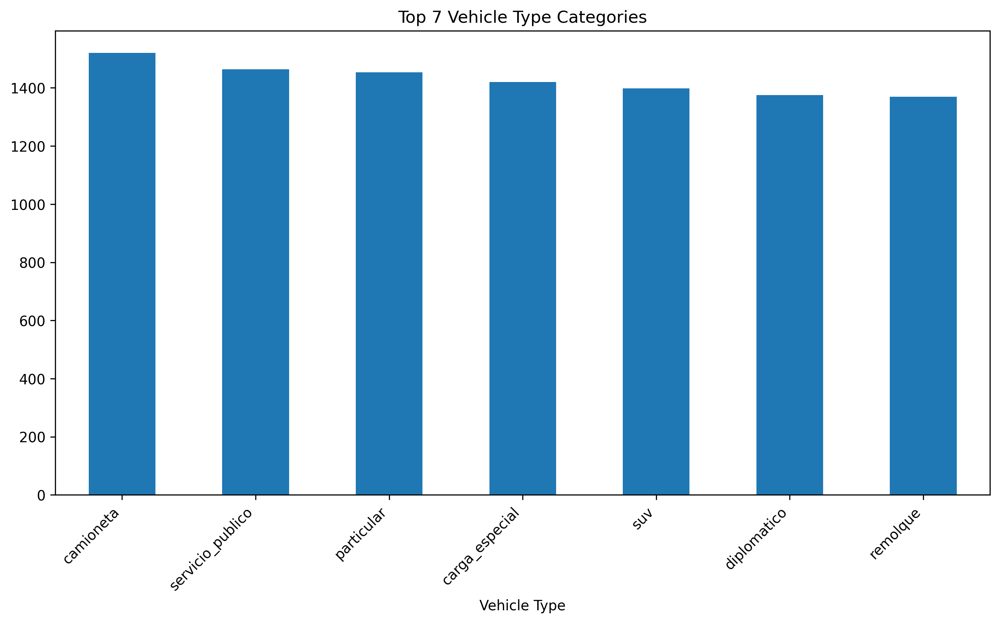
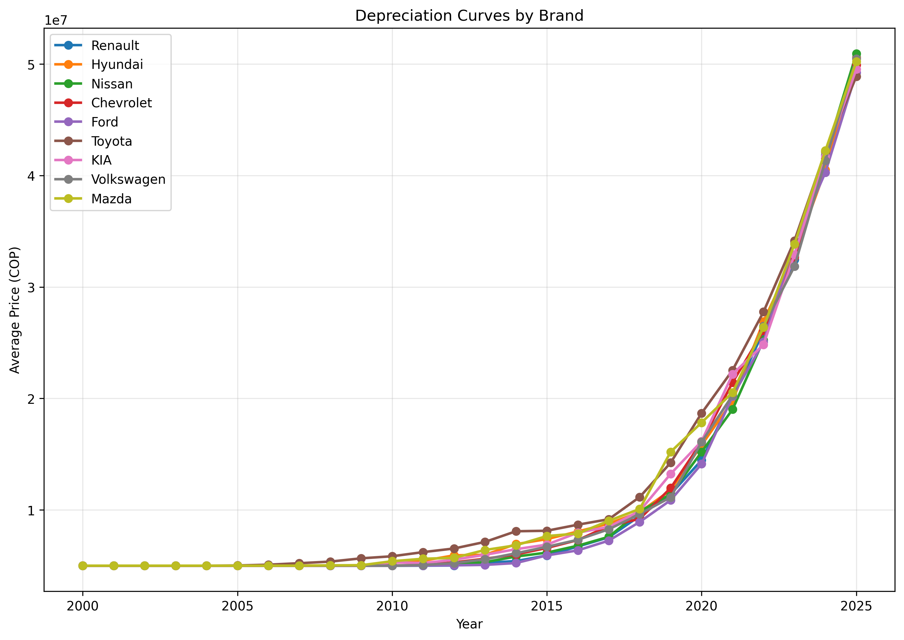
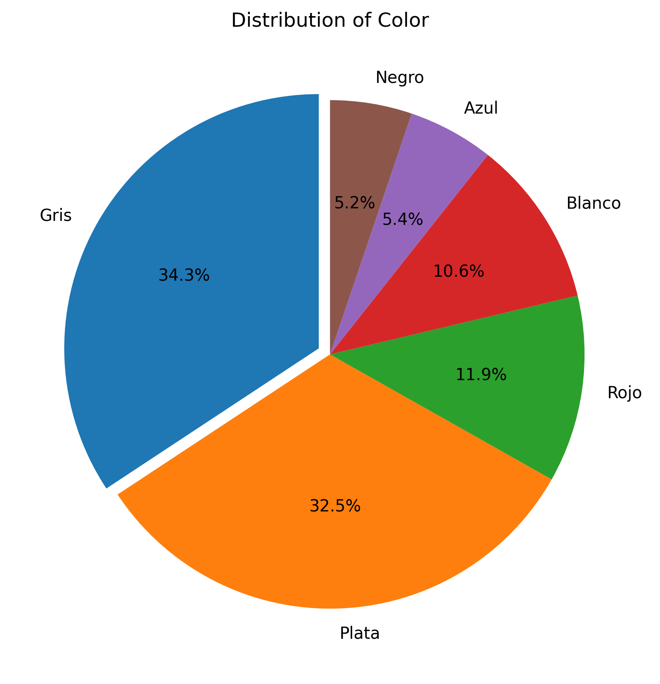
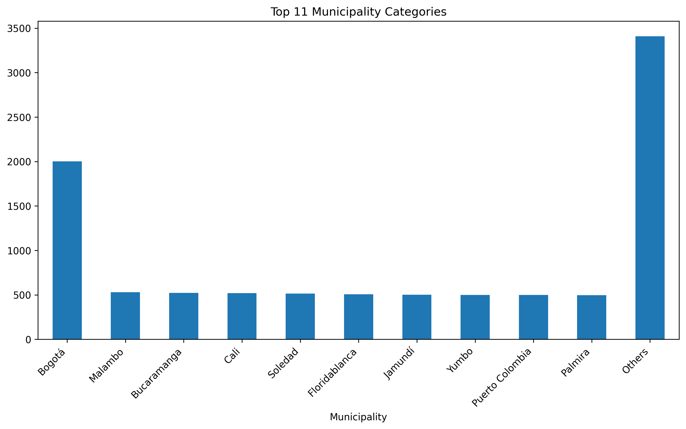

# Colombian Vehicle Data Generator

A Python-based synthetic data generator that creates realistic (but fictional) vehicle records for Colombia. Designed for automotive application testing, academic research, data analysis, and visualization projects while maintaining privacy compliance.
## Requirements

The following Python libraries are required to run this project:

- `pandas`
- `numpy`
- `faker`
- `matplotlib`
- `seaborn`
- `pathlib`
## Features

### Vehicle Data
- **Identification**: VIN, chassis number, engine number, Colombian license plates
- **Technical Specifications**: Make, model, year, body type, fuel type
- **Physical Characteristics**: Color, doors, seats, wheels, weight, engine displacement

### Technical Data
- **Safety**: ABS, airbags, ESP, seatbelts
- **Inspections**: SOAT (insurance validity), technical-mechanical inspection
- **Compliance**: Emission standards based on year

### Geographic Context
- Distribution across main Colombian departments and municipalities
- Vehicle-type specific license plates

### Economic Factors
- Prices based on realistic depreciation model
- Mileage adjusted according to vehicle type and age


## Usage

### Basic Usage

```python
from data_generator.vehicle_data_generator import generate_dataset

# Generate a dataset of 1000 vehicles
generate_dataset(n=1000, output_path='colombia_vehicles.csv')
```

### Command Line Usage

```bash
# Generate 1000 vehicle records
python app.py -n 1000 -o colombia_vehicles.csv

# Generate only private vehicles
python app.py -n 500 -o private_vehicles.csv -t particular

# Run benchmark
python app.py -n 5000 -b -s 1000
```

## Data Dictionary
| Field                 | Type   | Description                         | Example               | Generation Logic                                                                                                         |
| --------------------- | ------ | ----------------------------------- | --------------------- | ------------------------------------------------------------------------------------------------------------------------ |
| `vehicle_id`          | string | Unique vehicle ID                   | `"a5b8c2d1-..."`      | Generated as a UUID4 to ensure global uniqueness.                                                                        |
| `vin`                 | string | Vehicle Identification Number       | `"3VWFE21C04M000283"` | Uniform random 17-character string matching VIN format (alphanumeric, uppercase, excluding I/O/Q).                       |
| `chassis_number`      | string | Chassis number                      | `"8AF5XXBDJ5M"`       | Uniform random alphanumeric string of length 10–12.                                                                      |
| `engine_number`       | string | Engine number                       | `"B4204T31"`          | Uniform random uppercase alphanumeric, length 6–8.                                                                       |
| `license_plate`       | string | License plate                       | `"ABC 123"`           | Deterministically generated based on index to ensure uniqueness.                                      |
| `department`          | string | Registration department             | `"Cundinamarca"`      | Uniform random pick from list of Colombia's 32 departments.                                                              |
| `municipality`        | string | Registration municipality           | `"Bogotá"`            | Uniform random pick from municipalities within the chosen `department` (dependency).                                     |
| `brand`               | string | Vehicle make                        | `"Renault"`           | Weighted random: brands sampled with realistic market-share weights (e.g., Renault, Chevrolet, Mazda, etc.).             |
| `model`               | string | Vehicle model                       | `"Sandero"`           | Weighted random: model chosen conditional on `brand` (each brand has its own model list and weights).                    |
| `year`                | int    | Manufacturing year                  | `2018`                | Uniform random integer between 1990 and current year (2025), optionally skewed toward newer years.                       |
| `color`               | string | Vehicle color                       | `"White"`             | Weighted random: common colors (White, Black, Silver, Blue, Red, etc.) with higher weights for popular choices.          |
| `body_type`           | string | Body style                          | `"Hatchback"`         | Weighted random among body types (Sedan, Hatchback, SUV, Pickup, Van, etc.) using market-distribution weights.           |
| `vehicle_type`        | string | Usage category                      | `"particular"`        | Uniform random among categories {`particular`, `public`, `cargo`, `special`}.                                            |
| `fuel_type`           | string | Fuel type                           | `"Gasoline"`          | Weighted random among {Gasoline, Diesel, Hybrid, Electric, LPG} based on Colombian fleet percentages.                    |
| `engine_displacement` | float  | Engine displacement (L)             | `1.6`                 | Weighted random: choose from common displacements (e.g., 1.0, 1.2, 1.4, 1.6, 2.0, 2.5, etc.) with realistic frequencies. |
| `doors`               | int    | Number of doors                     | `5`                   | Uniform random pick from {2, 3, 4, 5} (with heavier weight on 4 and 5).                                                  |
| `seats`               | int    | Number of seats                     | `5`                   | Uniform random pick from {2, 4, 5, 7} with weight toward 5.                                                              |
| `wheels`              | int    | Number of wheels                    | `4`                   | Uniform random from {2, 3, 4, 6, 8}, but default = 4 for most passenger vehicles.                                        |
| `weight_kg`           | int    | Curb weight (kg)                    | `1200`                | Uniform random between 800 and 3500 kg according to `body_type` buckets (e.g., SUVs heavier than hatchbacks).            |
| `mileage_km`          | int    | Mileage (km)                        | `45000`               | Uniform random based on `year` (older → higher max mileage), e.g. 0–(current\_year–year)\*20 000 km.                     |
| `price_cop`           | int    | Price in COP                        | `35000000`            | Uniform random with dependency on `year`, `brand`, `model` and `mileage_km` using a simple depreciation formula.         |
| `emission_standard`   | string | Emission standard                   | `"Euro 4"`            | Uniform random chosen from {`Euro 2`, `Euro 3`, `Euro 4`, `Euro 5`, `Euro 6`} based on `year`.                           |
| `abs`                 | bool   | Anti-lock braking system            | `true`                | Uniform random with higher probability for newer `year` (e.g., P(abs = true) = min(1, (year–1990)/50)).                  |
| `airbags`             | int    | Number of airbags                   | `2`                   | Uniform random but weighted by `year` (older cars fewer airbags).                                                        |
| `esp`                 | bool   | Electronic stability control        | `false`               | Uniform random with probability increasing for `year` ≥ 2010 (e.g., 30% for 2010–2015, 70% for >2015).                   |
| `seatbelts`           | int    | Number of seatbelts                 | `5`                   | Uniform random = `seats` (1 belt per seat) with possible extras for center-seat lap belts.                               |
| `soat_policy`         | string | SOAT policy number                  | `"SOAT-12345"`        | Deterministically generated based on index to ensure uniqueness.                                           |
| `soat_validity`       | date   | SOAT expiration date                | `"2023-05-15"`        | Uniform random date: between `registration_date` and `registration_date + 1 year`.                                       |
| `techinsp_date`       | date   | Last technical inspection date      | `"2022-07-20"`        | Uniform random date: ≤ today, ≥ `registration_date`.                                                                     |
| `techinsp_result`     | string | Inspection result                   | `"Approved"`          | Uniform random among {`Approved`, `Rejected`} with high approval rate (>90%).                                            |
| `techinsp_validity`   | date   | Inspection validity end date        | `"2024-07-20"`        | = `techinsp_date + 1 year`.                                                                                              |
| `fur_code`            | string | FUR inspection code                 | `"FUR-123456"`        | Uniform random string with prefix "FUR-" plus 6-digit code.                                                              |
| `registration_date`   | date   | Initial registration date           | `"2018-03-10"`        | Uniform random date between `year-01-01` and today.                                                                      |
| `status`              | string | Vehicle status                      | `"Used"`              | Uniform random among {`New`, `Used`, `Suspended`, `Confiscated`}, with higher weight for `Used`.                         |
| `weight_capacity_kg`  | int    | Maximum load capacity (kg)          | `1440`                | Computed as 1.2 × `weight_kg` for cargo vehicles, or default = `weight_kg + 200` for passenger vehicles.                 |
| `seated_capacity`     | int    | Passenger seating capacity          | `5`                   | = `seats`.                                                                                                               |
| `standing_capacity`   | int    | Allowed standing passenger capacity | `0`                   | For public service vehicles only: uniform random between 0 and 10; otherwise 0.                                          |
| `horsepower_hp`       | int    | Engine power (HP)                   | `120`                 | Weighted random based on `engine_displacement` (e.g., 1.6 L → 100–120 HP, 2.0 L → 130–160 HP) with some variance.        |


## Sample Data

| license_plate | brand | model | year | vehicle_type | color | mileage_km | price_cop |
|---------------|-------|-------|------|--------------|-------|------------|-----------|
| ABC 123 | Chevrolet | Spark | 2018 | particular | White | 35000 | 28500000 |
| XYZ 789 | Renault | Duster | 2015 | particular | Gray | 78500 | 32000000 |
| MNL 456 | Nissan | Versa | 2020 | servicio_publico | White | 125000 | 42700000 |
| RHJ 234 | KIA | Rio | 2019 | particular | Silver | 45200 | 38900000 |
| T 5638 | Ford | Ranger | 2017 | carga_especial | White | 98300 | 75600000 |

## Data Realism

### Make and Model Distribution
- Weighted according to actual popularity in the Colombian market:
  - Chevrolet (20%), Renault (18%), Nissan (17%), etc.

### Vehicle Depreciation
- Calculated using brand-specific formulas:
  - Toyota (6% annual), Renault (9% annual), etc.
  - Additional adjustment based on mileage

### License Plates
- Specific format according to vehicle type:
  - Private: 3 letters + 3 numbers (ABC 123)
  - Diplomatic: Code letter + letter + 4 numbers (CD A1234)
  - Trailer: R/S + 5 numbers (R 12345)

### Safety Features
- Implementation based on vehicle year:
  - ABS mandatory since 2012
  - Airbags with probabilistic distribution by year
  - ESP mandatory since 2015/2020 (depending on type)

## Customization

Modify these variables in the code:

### Makes and models in `vehicle_data_generator.py`:
```python
BRANDS = [
    'Chevrolet', 'Renault', 'Nissan', 'KIA',
    'Ford', 'Volkswagen', 'Hyundai', 'Toyota', 'Mazda'
]
BRANDS_WEIGHTS = [0.20, 0.18, 0.17, 0.12, 0.10, 0.08, 0.06, 0.05, 0.04]
```

### Departments and municipalities:
```python
DEPARTMENTS_MUNICIPALITIES = {
    'Cundinamarca':    ['Bogotá'],
    'Antioquia':       ['Medellín', 'Bello', 'Envigado', 'Itagüí', 'Sabaneta'],
    # ...
}
```

### Depreciation rates:
```python
DEPRECIATION_RATES = {
    'Chevrolet': 0.08, 'Renault': 0.09, 'Toyota': 0.06,
    # ...
}
```

## Benchmark

The generator includes a benchmark function to evaluate performance:

```bash
python app.py -n 10000 -b -s 1000
```

This will generate a `benchmark.png` chart showing generation time vs. dataset size.


## Coverage

Make sure you have "coverage" in your requirements.txt file and run pip install. Then run `python -m coverage run -m unittest discover` and after that run `python -m coverage report` to get the following table:
```
Name                                       Stmts   Miss  Cover
--------------------------------------------------------------
data_generator\vehicle_data_generator.py     176     14    92%
tests\__init__.py                              0      0   100%
tests\test_vehicle_data_generator.py          55      5    91%
--------------------------------------------------------------
TOTAL                                        231     19    92%
```
## Data Analysis Visualizations

The generated dataset comes with comprehensive analysis visuals in the `analysis_results` directory:

### Key Distributions
 



### Geographical Analysis


### Technical Specifications
**Engine Displacement**  


**Weight Distribution**  


**Mileage Analysis**  


### Market Trends
**Price Distribution**  


**Depreciation Curves**  


**Vehicle Age Distribution**  


### Feature Correlations


### Detailed Breakdowns
| Body Types | Colors | Seating Capacity |
|------------|--------|------------------|
|  |  |  |

| Municipal Distribution | Model Popularity |
|-------------------------|------------------|
|  |  |

All visualizations are generated automatically with the dataset and can be reproduced using the included analysis scripts.
### Times to generate data

## Changelog
### New Attributes
* weight_capacity_kg: Maximum load capacity, computed based on weight_kg and vehicle_type.

* seated_capacity: Number of passengers that can be seated (equal to seats).

* standing_capacity: Standing passenger capacity, used only for public service vehicles.

* horsepower_hp: Estimated engine power, sampled based on engine_displacement.

* These attributes help simulate vehicle usage in logistics, public transport, and performance scenarios.

## Price Distribution & Visualization Enhancements
* Revised price generation:

   * Takes into account year, mileage_km, and engine_displacement.

   * Uses brand-specific depreciation rates to simulate realistic market values.

* New analysis plots added:

    * Year vs. Price: shows how vehicle age impacts value.

    * Engine Displacement vs. Price: explores how engine size correlates with cost.

These graphs are included in the analysis_results folder and are auto-generated during data analysis.

## Uniqueness Control
To ensure realistic data integrity:

* License plates (license_plate) and SOAT policies (soat_policy) are now guaranteed to be unique.

* This is implemented using a deterministic generation approach where each vehicle's identifying information is based on its unique index, eliminating the need for runtime uniqueness checking and improving performance for large datasets.

* The deterministic approach enables generation of millions of records with guaranteed uniqueness while maintaining realistic data patterns based on Colombian vehicle registration standards.