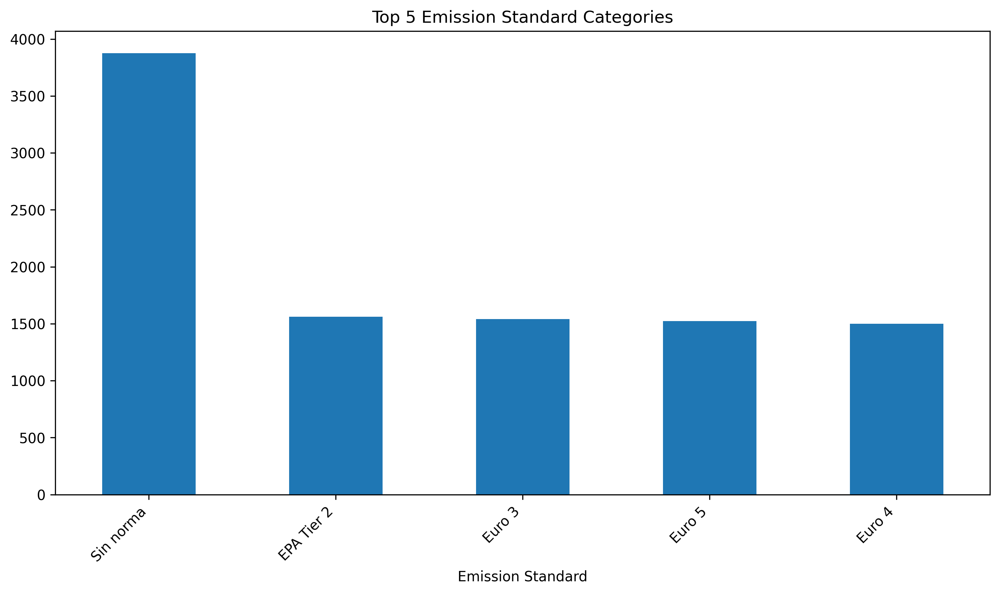
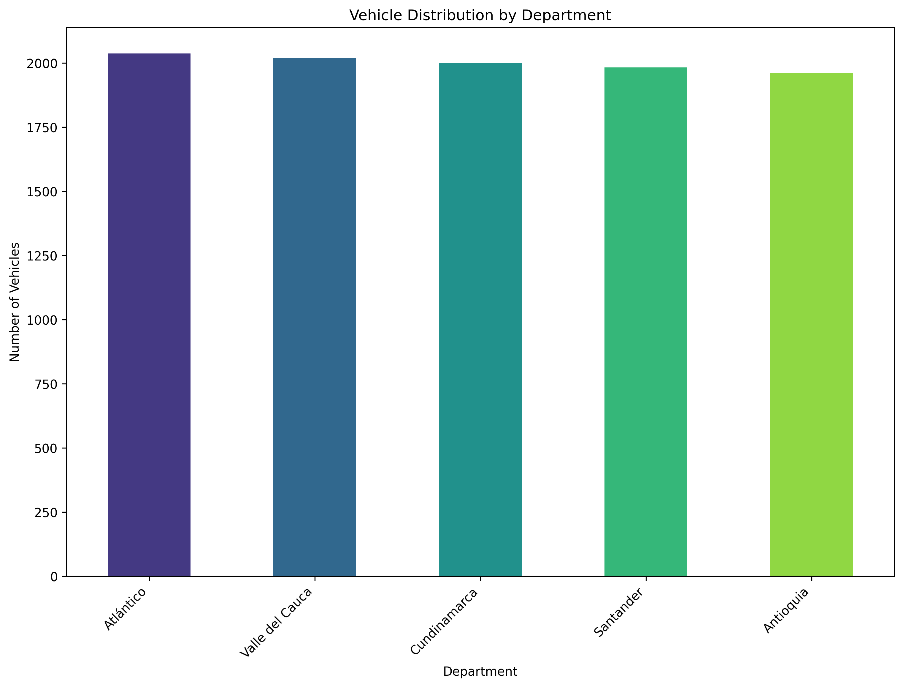
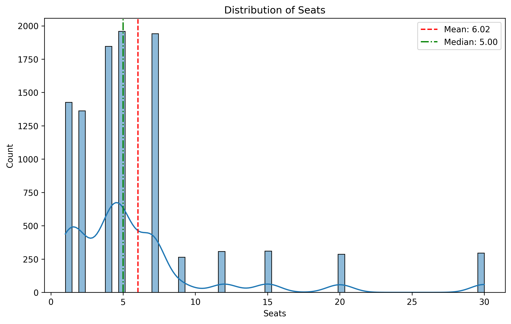

# Colombian Vehicle Data Generator

A Python-based synthetic data generator that creates realistic (but fictional) vehicle records for Colombia. Designed for automotive application testing, academic research, data analysis, and visualization projects while maintaining privacy compliance.
## Requirements

The following Python libraries are required to run this project:

- `pandas`
- `numpy`
- `faker`
- `matplotlib`
- `seaborn`
- `pathlib`
## Features

### Vehicle Data
- **Identification**: VIN, chassis number, engine number, Colombian license plates
- **Technical Specifications**: Make, model, year, body type, fuel type
- **Physical Characteristics**: Color, doors, seats, wheels, weight, engine displacement

### Technical Data
- **Safety**: ABS, airbags, ESP, seatbelts
- **Inspections**: SOAT (insurance validity), technical-mechanical inspection
- **Compliance**: Emission standards based on year

### Geographic Context
- Distribution across main Colombian departments and municipalities
- Vehicle-type specific license plates

### Economic Factors
- Prices based on realistic depreciation model
- Mileage adjusted according to vehicle type and age


## Usage

### Basic Usage

```python
from data_generator.vehicle_data_generator import generate_dataset

# Generate a dataset of 1000 vehicles
df = generate_dataset(n=1000)

# Export to CSV
df.to_csv('colombia_vehicles.csv', index=False)
```

### Command Line Usage

```bash
# Generate 1000 vehicle records
python app.py -n 1000 -o colombia_vehicles.csv

# Generate only private vehicles
python app.py -n 500 -o private_vehicles.csv -t particular

# Run benchmark
python app.py -n 5000 -b -s 1000
```

## Data Dictionary

| Field | Type | Description | Example |
|-------|------|-------------|---------|
| vehicle_id | string | Unique vehicle ID | "a5b8c2d1-..." |
| vin | string | Vehicle Identification Number | "3VWFE21C04M000283" |
| chassis_number | string | Chassis number | "8AF5XXBDJ5M" |
| engine_number | string | Engine number | "B4204T31" |
| license_plate | string | Vehicle license plate | "ABC 123" |
| department | string | Registration department | "Cundinamarca" |
| municipality | string | Registration municipality | "Bogotá" |
| brand | string | Vehicle make | "Renault" |
| model | string | Vehicle model | "Sandero" |
| year | int | Manufacturing year | 2018 |
| color | string | Vehicle color | "White" |
| body_type | string | Body type | "Hatchback" |
| vehicle_type | string | Vehicle type | "particular" |
| fuel_type | string | Fuel type | "Gasoline" |
| engine_displacement | float | Engine displacement | 1.6 |
| doors | int | Number of doors | 5 |
| seats | int | Number of seats | 5 |
| wheels | int | Number of wheels | 4 |
| weight_kg | int | Weight in kilograms | 1200 |
| mileage_km | int | Mileage | 45000 |
| price_cop | int | Price in Colombian pesos | 35000000 |
| emission_standard | string | Emission standard | "Euro 4" |
| abs | bool | Anti-lock braking system | true |
| airbags | int | Number of airbags | 2 |
| esp | bool | Electronic stability control | false |
| seatbelts | int | Number of seatbelts | 5 |
| soat_policy | string | SOAT policy number | "SOAT-12345" |
| soat_validity | date | SOAT validity date | "2023-05-15" |
| techinsp_date | date | Technical inspection date | "2022-07-20" |
| techinsp_result | string | Inspection result | "Approved" |
| techinsp_validity | date | Inspection validity | "2024-07-20" |
| fur_code | string | FUR code | "FUR-123456" |
| registration_date | date | Registration date | "2018-03-10" |
| status | string | Vehicle status | "Used" |

## Sample Data

| license_plate | brand | model | year | vehicle_type | color | mileage_km | price_cop |
|---------------|-------|-------|------|--------------|-------|------------|-----------|
| ABC 123 | Chevrolet | Spark | 2018 | particular | White | 35000 | 28500000 |
| XYZ 789 | Renault | Duster | 2015 | particular | Gray | 78500 | 32000000 |
| MNL 456 | Nissan | Versa | 2020 | servicio_publico | White | 125000 | 42700000 |
| RHJ 234 | KIA | Rio | 2019 | particular | Silver | 45200 | 38900000 |
| T 5638 | Ford | Ranger | 2017 | carga_especial | White | 98300 | 75600000 |

## Data Realism

### Make and Model Distribution
- Weighted according to actual popularity in the Colombian market:
  - Chevrolet (20%), Renault (18%), Nissan (17%), etc.

### Vehicle Depreciation
- Calculated using brand-specific formulas:
  - Toyota (6% annual), Renault (9% annual), etc.
  - Additional adjustment based on mileage

### License Plates
- Specific format according to vehicle type:
  - Private: 3 letters + 3 numbers (ABC 123)
  - Diplomatic: Code letter + letter + 4 numbers (CD A1234)
  - Trailer: R/S + 5 numbers (R 12345)

### Safety Features
- Implementation based on vehicle year:
  - ABS mandatory since 2012
  - Airbags with probabilistic distribution by year
  - ESP mandatory since 2015/2020 (depending on type)

## Customization

Modify these variables in the code:

### Makes and models in `vehicle_data_generator.py`:
```python
BRANDS = [
    'Chevrolet', 'Renault', 'Nissan', 'KIA',
    'Ford', 'Volkswagen', 'Hyundai', 'Toyota', 'Mazda'
]
BRANDS_WEIGHTS = [0.20, 0.18, 0.17, 0.12, 0.10, 0.08, 0.06, 0.05, 0.04]
```

### Departments and municipalities:
```python
DEPARTMENTS_MUNICIPALITIES = {
    'Cundinamarca':    ['Bogotá'],
    'Antioquia':       ['Medellín', 'Bello', 'Envigado', 'Itagüí', 'Sabaneta'],
    # ...
}
```

### Depreciation rates:
```python
DEPRECIATION_RATES = {
    'Chevrolet': 0.08, 'Renault': 0.09, 'Toyota': 0.06,
    # ...
}
```

## Benchmark

The generator includes a benchmark function to evaluate performance:

```bash
python app.py -n 10000 -b -s 1000
```

This will generate a `benchmark.png` chart showing generation time vs. dataset size.


## Coverage

Make sure you have "coverage" in your requirements.txt file and run pip install. Then run `python -m coverage run -m unittest discover` and after that run `python -m coverage report` to get the following table:
```
Name                                       Stmts   Miss  Cover
--------------------------------------------------------------
data_generator\vehicle_data_generator.py     176     14    92%
tests\__init__.py                              0      0   100%
tests\test_vehicle_data_generator.py          55      5    91%
--------------------------------------------------------------
TOTAL                                        231     19    92%
```
## Data Analysis Visualizations

The generated dataset comes with comprehensive analysis visuals in the `analysis_results` directory:

### Key Distributions
 




### Geographical Analysis



### Technical Specifications
**Engine Displacement**  


**Weight Distribution**  


**Mileage Analysis**  


### Market Trends
**Price Distribution**  


**Depreciation Curves**  


**Vehicle Age Distribution**  


### Feature Correlations


### Detailed Breakdowns
| Body Types | Colors | Seating Capacity |
|------------|--------|------------------|
|  |  |  |

| Municipal Distribution | Model Popularity |
|-------------------------|------------------|
|  |  |

All visualizations are generated automatically with the dataset and can be reproduced using the included analysis scripts.
### Times to generate data

